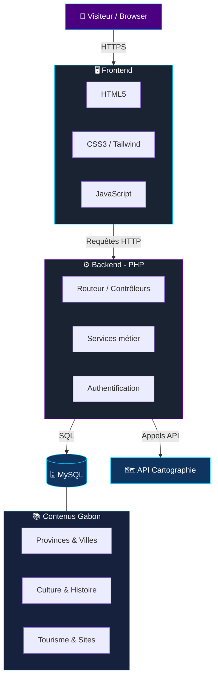

<!-- ========================= HEADER ========================= -->

  

<h2 align="center">
Hi 👋 I'm Desmond
</h2>

<h4 align="center">
Full Stack • Flutter • AI • Automation • Networks • DevOps
</h4>

<!-- Profile views counter -->

  

---

<!-- ========================= DEVELOPER GIF / ILLUSTRATION ========================= -->

  

  

---

# 👨🏽‍💻 About Me

🎓 Network & Telecommunications Engineering student (USTM)

💙 Passionate about

- 🤖 Artificial Intelligence
- 📱 Flutter Cross-Platform Development
- 🌐 Full Stack Web Development
- ⚙️ Workflow Automation (n8n)
- ☁️ DevOps
- 🔐 Cybersecurity
- 🐧 Linux

---

# 🚀 Currently Working On

✅ AI Agents with n8n + Ollama + GPT

✅ Flutter Mobile Applications

✅ Django & PHP Web Applications

✅ Network Automation

✅ "Connaître le Gabon"

✅ Lunch Ordering Platform

---

# 🏅 Certifications

<!--
  Astuce : pour afficher l'image officielle du badge Credly à la place du badge Shields,
  ouvre ton badge sur Credly → "Share" → "Embed" et remplace le bloc ci-dessus par l' fourni.
  Tu peux empiler ici tes futures certifs (CCNA, Linux, etc.) sur le même modèle.
-->

---

# 💻 Tech Stack

## Languages

  

## Frameworks

  

## Databases

  

## DevOps

  

## AI & Automation

  
  
  

---

# 📌 Featured Projects

<!--
  Ces cartes affichent AUTOMATIQUEMENT le nom, la description et le nombre d'étoiles de chaque dépôt.
  Elles se mettent à jour toutes seules quand tu modifies un repo.
-->

---

# 🌍 Architecture — « Connaître le Gabon »

<!-- GitHub rend Mermaid nativement : ce schéma s'affiche directement dans le README -->

> 💡 Adapte ce schéma à ta vraie stack (ajoute une API REST, un cache, un CDN… selon ton implémentation).

---

# 📊 GitHub Analytics

  
  

---

# 🔥 GitHub Streak

  

---

# 📈 Contribution Graph

  

---

# ⏱️ WakaTime — Temps de code par langage

<!--
  POUR ACTIVER :
  1. Crée un compte sur https://wakatime.com et installe le plugin dans VS Code / ton IDE.
  2. Dans GitHub : ajoute le secret WAKATIME_API_KEY (Settings → Secrets → Actions).
  3. Utilise l'Action "athul/waka-readme" OU remplace simplement YOUR_WAKATIME_USERNAME ci-dessous.
-->

<!-- 

  

  <figure><embed src="https://wakatime.com/share/@DESMOND_77/d373e299-d0e5-4896-be5c-dc4431ef8702.svg"></embed></figure>

 -->

---

# 🎧 Now Playing on Spotify

<!--
  POUR ACTIVER (déploiement rapide) :
  1. Va sur https://github.com/kittinan/spotify-github-profile
  2. Connecte ton compte Spotify (1 clic) → tu obtiens une URL avec ton uid.
  3. Remplace l'URL ci-dessous par celle générée pour toi.
-->

  

---

# ⬇️ Project Downloads

<!--
  Ces badges comptent les téléchargements des RELEASES GitHub.
  Ils ne s'afficheront que pour les repos qui ont au moins une release publiée.
  Crée une release (Releases → Draft a new release) puis dé-commente la ligne voulue.
-->

  <!--  -->
  <!--  -->
  

---

# 🏆 GitHub Trophies

  

---

# 🐍 Contribution Snake

  

---

# 🎯 Fun Facts

- 🤖 J'adore **automatiser les tâches répétitives** — si je le fais deux fois, je le scripte.
- 🐧 Je travaille principalement sous **Ubuntu / Linux** (avec un terminal `zsh` cyberpunk 😎).
- ☕ Mon combo préféré : un café, un workflow **n8n** et un agent IA local (**Ollama**).
- 📱 Je passe du **réseau & télécom** au **Flutter** sans transition — c'est ma zone de confort.
- 🌍 Je construis des projets qui parlent de mon pays, le **Gabon** 🇬🇦.
- 🔄 Ma devise de dev : *Code. Learn. Automate. Build. Repeat.*

---

# 🌍 Connect With Me

---

# 💡 Quote

> **"Code. Learn. Automate. Build. Repeat."**

---

  

